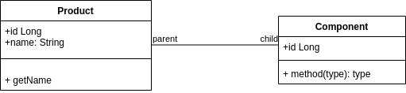

# GraphQL POC with Java and MySQL

## Stating the development environment

Building the app

```
docker run -v $(pwd)/QueryService:/app -w /app -v ~/.m2:/root/.m2 -it maven:3.6.3-jdk-8 mvn clean compile package -DskipTests
```

Running the composed the application

```
docker-compose up --build
```
This will start a mysql database and the product service.

You can access the system via. http://localhost:8080/graphiql

## Application overview 

The POC application demonstrates two entities related to each other: Product and component

